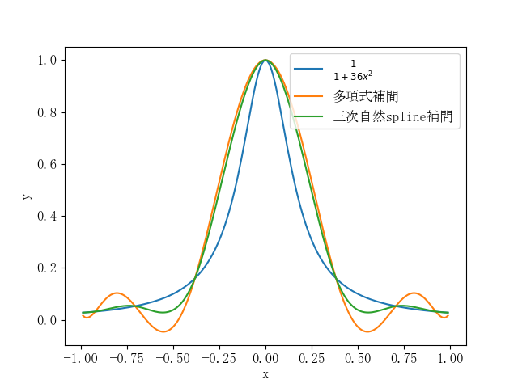

## 数値積分

ロンバーグ積分（ロンバーグせきぶん、Romberg integration）またはロンベルク積分は、関数の数値積分アルゴリズムのひとつである。この方法では台形公式とリチャードソンの補外を組み合わせ離散化幅 $h$ をゼロとする極限として数値積分を評価する。他の数値積分法に比べ、少ない回数の被積分関数の評価によって高精度の結果が得られる。 1955年にヴェルナー・ロンベルクによって考案された

Clenshaw–Curtis quadrature and Fejér quadrature are methods for numerical integration, or "quadrature", that are based on an expansion of the integrand in terms of Chebyshev polynomials. Equivalently, they employ a change of variables {\displaystyle x=\cos \theta }x=\cos \theta  and use a discrete cosine transform (DCT) approximation for the cosine series. Besides having fast-converging accuracy comparable to Gaussian quadrature rules, Clenshaw–Curtis quadrature naturally leads to nested quadrature rules (where different accuracy orders share points), which is important for both adaptive quadrature and multidimensional quadrature (cubature).
クレンショウ-カーティス求積法はチェビシェフ多項式による被積分関数の展開に基づく数値積分の一種である．
$x=\cos \theta$の変数変換を使用し余弦級数には離散コサイン変換(DCT)近似を用いる．

図に各数値積分手法の比較を示す．$\int_0^2 e_x dx$の積分において romberg 積分は相対誤差$4.54\times10^{−8}$
と実用上十分な精度が出ている一方でCrenshaw-Curtis則では相対誤差$2.08\times10^{−2}$で精度が比較的に低いと言える．
被積分関数の評価回数は両者とも8回だが，romberg積分が等間隔に被積分関数を評価するのに対し，
Crenshaw-Curtis則ではチェビシェフ多項式を用いて中央より区間端を重点的に評価している点が精度に影響を与えていると考えられる．
ただし，Crenshaww-Curtis 則の計算に誤りがある可能性は否定できない．

## 補間

図に元の関数，チェビシェフ点を用いた8次多項式補間，スプライン補間を重ねて示す．
8次多項式補間では区間分割が無く一つの多項式で近似しているため，全てのxで全次数$f^{(0)}~f^{(8)}$が連続であるが，その連続性の制約が強く働き補間点以外では振動し近似が正確ではない．一方，三次スプライン補間は区間を分割し$f'''$が不連続であることを許容しているので$f,f',f''$を元の関数に近づける自由度が確保されており，比較的正確な補間ができている．